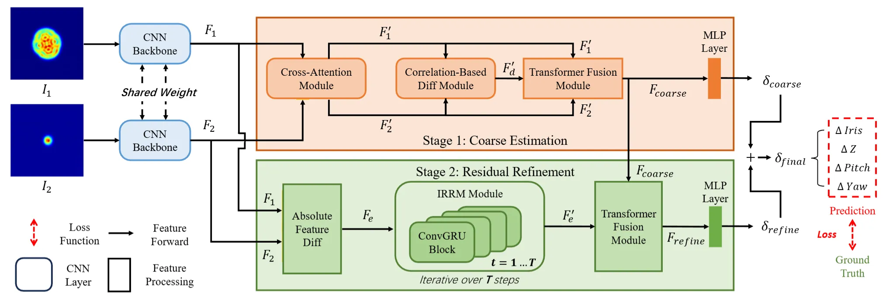
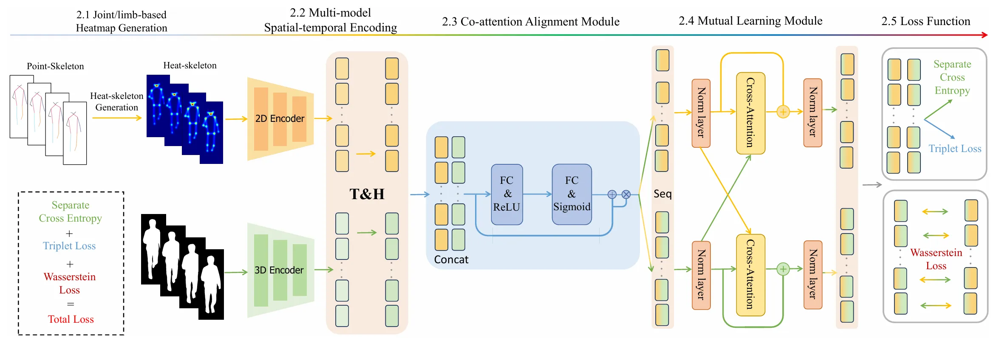
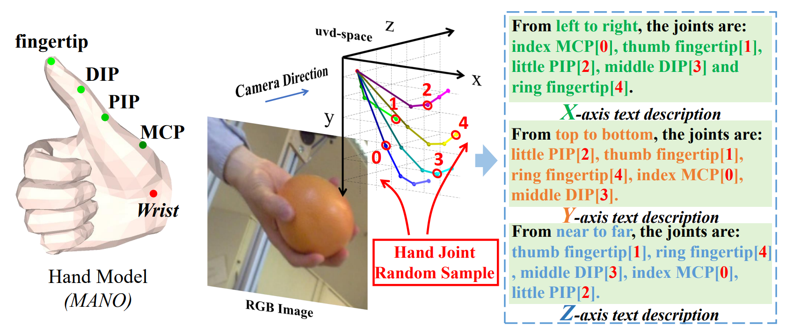
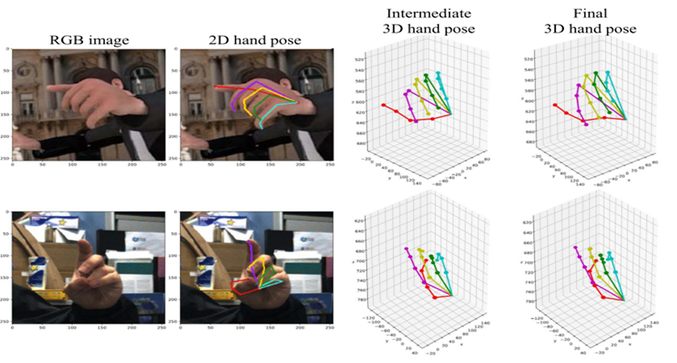
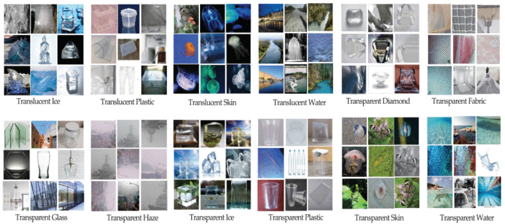
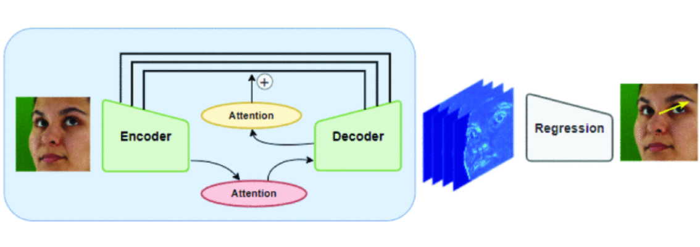

Hello, welcome to Shaoxiang Guo's homepage.

I received my Ph.D. degree (Computer Application Technology) from Ocean University of China (OUC) in 2024. I am currently a Postdoctoral Researcher at Zhejiang University (College of Information Science and Electronic Engineering), working with Prof. Susanto Rahardja. Previously, I was a Postdoctoral Research Associate at the National Robotarium (Heriot-Watt University & University of Edinburgh), where I contributed to an EPSRC-funded project on data-driven laser resonator alignment.

My research interests broadly include computer vision, machine learning, deep learning, and geometry-aware representation learning, with a focus on:
- Monocular 3D hand pose/mesh reconstruction (camera-space reconstruction, ambiguity mitigation)
- Geometry-guided learning (e.g., training-time pseudo-stereo supervision; cross-attention fusion)
- Beam image understanding for optical alignment (dataset construction; coarse-to-fine prediction; real-world deployment)
- (Recently exploring) speaker diarization and audio representation learning

Contact & Profiles
==================
- Email: gsx311381@gmail.com ; S.Guo@hw.ac.uk ; guoshaoxiang@stu.ouc.edu.cn
- Research profiles: <a href="#">ResearchGate</a> | <a href="#">ORCID</a> | <a href="#">Google Scholar</a>
- Code: <a href="https://github.com/ShaoXiang23">GitHub</a>

Experience
==========
- Postdoctoral Researcher, Zhejiang University (ZJU), Hangzhou, China, Dec 2025 – Present  
  Advisor: Prof. Susanto Rahardja
- Postdoctoral Research Associate, National Robotarium (Heriot-Watt University & University of Edinburgh), Edinburgh, UK, Sep 2024 – Aug 2025  
  Advisor: Prof. Mustafa Suphi Erden; Collaborators: Prof. Mike J. Chantler, Prof. M. J. Daniel Esser, Dr. Richard M. Carter

Publications
============

<!-- New/Recent (please add paper figure links and official URLs/DOIs if needed) -->
<table style="width:100%;border-collapse:collapse;border:none;margin-right:auto;margin-left:auto;padding-top:10px;">
    <tbody> 
        <tr>
            <td style="padding:10px;width:30%;vertical-align:middle;text-align:center;">
                
            </td>
            <td valign="middle">
                

                    <papertitle>A Two-Stage Learning Framework with a Beam Dataset for Automatic Laser Resonator Alignment</papertitle>
                     
                    <b>Shaoxiang Guo</b>, Donald Risbridger, Richard Carter, Xianwen Kong, Daniel Esser, Mike Chantler, Mustafa Suphi Erden.
                     
                    Pattern Recognition, 2026.
                     
                    <!-- <a href="">[PDF]</a> <a href="">[Code]</a> <a href="">[Dataset]</a> -->
                

            </td>
        </tr>
    </tbody>
</table>

<table style="width:100%;border-collapse:collapse;border:none;margin-right:auto;margin-left:auto;padding-top:10px;">
    <tbody> 
        <tr>
            <td style="padding:10px;width:30%;vertical-align:middle;text-align:center;">
                
            </td>
            <td valign="middle">
                

                    <papertitle>Pseudo Stereo for Camera-Space Hand Pose and Shape Estimation from Monocular Image</papertitle>
                     
                    <b>Shaoxiang Guo</b>, Qing Cai, Wankun Chen, Jingyi Sun, Junyu Dong, Hui Yu.
                     
                    Knowledge-Based Systems, 2025. (In Revision)
                     
                    <!-- <a href="">[PDF]</a> <a href="">[Code]</a> -->
                

            </td>
        </tr>
    </tbody>
</table>

<table style="width:100%;border-collapse:collapse;border:none;margin-right:auto;margin-left:auto;padding-top:10px;">
    <tbody> 
        <tr>
            <td style="padding:10px;width:30%;vertical-align:middle;text-align:center;">
                
            </td>
            <td valign="middle">
                

                    <papertitle>GaitMA: Pose-guided Multi-modal Feature Fusion for Gait Recognition</papertitle>
                     
                    Fanxu Min, <b>Shaoxiang Guo</b>, Hao Fan, Junyu Dong.
                     
                    IEEE International Conference on Multimedia and Expo (ICME), 2024.
                     
                    <!-- <a href="">[PDF]</a> -->
                

            </td>
        </tr>
    </tbody>
</table>

<!-- Existing entries (hyperlinks preserved) -->
<table style="width:100%;border-collapse:collapse;border:none;margin-right:auto;margin-left:auto;padding-top:10px;">
    <tbody> 
        <tr>
            <td style="padding:10px;width:30%;vertical-align:middle;text-align:center;">
                
            </td>
            <td valign="middle">
                

                    <a href="https://dl.acm.org/doi/10.1145/3581783.3612390">
                        <papertitle>CLIP-Hand3D: Exploiting 3D Hand Pose Estimation via Context-Aware Prompting</papertitle>
                    </a>
                     
                    <b>Shaoxiang Guo</b>, Qing Cai, Lin Qi and Junyu Dong.
                     
                    Proceedings of the 31st ACM International Conference on Multimedia (<b>ACM MM</b>), 2023.  
                     
                    <a href="https://github.com/ShaoXiang23/CLIP_Hand_Demo">[Code]</a>               
                

            </td>
        </tr>
    </tbody>
</table>

<table style="width:100%;border-collapse:collapse;border:none;margin-right:auto;margin-left:auto;padding-top:10px;">
    <tbody> 
        <tr>
            <td style="padding:10px;width:30%;vertical-align:middle;text-align:center;">
                
            </td>
            <td valign="middle">
                

                    <a href="https://ieeexplore.ieee.org/abstract/document/9680673/">
                        <papertitle>3D Hand Pose Estimation From Monocular RGB With Feature Interaction Module</papertitle>
                    </a>
                     
                    <b>Shaoxiang Guo</b>, Eric Rigall, Yakun Ju, Junyu Dong.
                     
                    IEEE Transactions on Circuits and Systems for Video Technology (<b>IEEE T-CSVT</b>), 2022.  
                     
                    <a href="">[Code]</a>               
                

            </td>
        </tr>
    </tbody>
</table>

<table style="width:100%;border-collapse:collapse;border:none;margin-right:auto;margin-left:auto;padding-top:10px;">
    <tbody> 
        <tr>
            <td style="padding:10px;width:30%;vertical-align:middle;text-align:center;">
                
            </td>
            <td valign="middle">
                

                    <a href="https://ieeexplore.ieee.org/abstract/document/9680673/">
                        <papertitle>Graph-Based CNNs With Self-Supervised Module for 3D Hand Pose Estimation From Monocular RGB</papertitle>
                    </a>
                     
                    <b>Shaoxiang Guo</b>, Eric Rigall, Lin Qi, Xinghui Dong, Haiyan Li and Junyu Dong.
                     
                    IEEE Transactions on Circuits and Systems for Video Technology (<b>IEEE T-CSVT</b>), 2021.  
                     
                    <!-- <a href="">[Code]</a>                -->
                

            </td>
        </tr>
    </tbody>
</table>

<table style="width:100%;border-collapse:collapse;border:none;margin-right:auto;margin-left:auto;padding-top:10px;">
    <tbody> 
        <tr>
            <td style="padding:10px;width:30%;vertical-align:middle;text-align:center;">
                
            </td>
            <td valign="middle">
                

                    <a href="https://ieeexplore.ieee.org/abstract/document/9950355">
                        <papertitle>Transmittance Surface Detection and Material Identification Using Multitask ViT-SIFT Fusion</papertitle>
                    </a>
                     
                    Amanuel Hirpa Madessa, Junyu Dong, Eric Rigall, Qingxuan Lv, Hafiza Sadia Nawaz Nawaz, Israel Mugunga and <b>Shaoxiang Guo</b>.
                     
                    IEEE Transactions on Instrumentation and Measurement (<b>IEEE T-IM</b>), 2022.  
                     
                    <!-- <a href="">[Code]</a>                -->
                

            </td>
        </tr>
    </tbody>
</table>

<table style="width:100%;border-collapse:collapse;border:none;margin-right:auto;margin-left:auto;padding-top:10px;">
    <tbody> 
        <tr>
            <td style="padding:10px;width:30%;vertical-align:middle;text-align:center;">
                
            </td>
            <td valign="middle">
                

                    <a href="https://ieeexplore.ieee.org/abstract/document/9481150">
                        <papertitle>Incorporating lambertian priors into surface normals measurement</papertitle>
                    </a>
                     
                    Yakun Ju, Muwei Jian, <b>Shaoxiang Guo</b>, Yingyu Wang, Huiyu Zhou, Junyu Dong
                     
                    IEEE Transactions on Instrumentation and Measurement (<b>IEEE T-IM</b>), 2021.  
                     
                    <!-- <a href="">[Code]</a>                -->
                

            </td>
        </tr>
    </tbody>
</table>

<table style="width:100%;border-collapse:collapse;border:none;margin-right:auto;margin-left:auto;padding-top:10px;">
    <tbody> 
        <tr>
            <td style="padding:10px;width:30%;vertical-align:middle;text-align:center;">
                
            </td>
            <td valign="middle">
                

                    <a href="https://ieeexplore.ieee.org/abstract/document/9886734">
                        <papertitle>An Encoder-Decoder Network with Residual and Attention Blocks for Full-Face 3D Gaze Estimation</papertitle>
                    </a>
                     
                    Xinyuan Song, <b>Shaoxiang Guo</b>, Zhenfu Yu and Junyu Dong
                     
                    International Conference on Image, Vision and Computing (<b>ICIVC</b>), 2022.  
                     
                    <!-- <a href="">[Code]</a>                -->
                

            </td>
        </tr>
    </tbody>
</table>

Projects / Demos
================
- Beam-profile dataset construction for optical alignment (image collection, pairing strategy, labeling, validation)
- Real-world laser resonator alignment system (coarse-to-fine regression + iterative refinement, hardware-in-the-loop experiments)
- Monocular 3D hand mesh reconstruction framework (training-time geometric supervision; camera-space reconstruction)
- (Exploring) speaker diarization pipelines and model reproduction for real-world audio

Honors and Awards
=================
- Excellent Graduate, Ocean University of China, 2024
- National Scholarship (PhD), Ocean University of China & Ministry of Education of the People's Republic of China, 2022
- Academic Scholarship, Ocean University of China, 2020-2023
- LEICE Chuangxin "Minzhi" Scholarship, Ocean University of China, 2023
- Excellent Graduate Student, Ocean University of China, 2023
- Excellent Graduate Student, Ocean University of China, 2021
- "Internet+" Innovation and Entrepreneurship Competition, Second Prize, Ocean University of China, 2021
- Second Class Academic Scholarship, Ocean University of China, 2018-2019
- Mobile Robotics Challenge, First Prize, ROS Summer School, Tsinghua University (Shenzhen), 2018
- LiDAR Recognition Challenge, Second Prize, ROS Summer School, Tsinghua University (Shenzhen), 2018

Educations
==========
- Ph.D., Computer Application Technology, Faculty of Information Science and Engineering, Ocean University of China, 2020-2024
- Master's Degree, Software Engineering, School of Information Science and Engineering, Ocean University of China, 2017-2020
- Bachelor's Degree, Software Engineering, School of Information Science and Engineering, Qufu Normal University, 2013-2017
